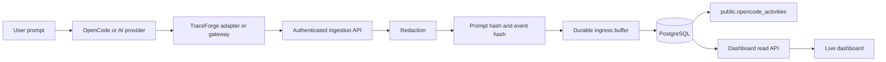
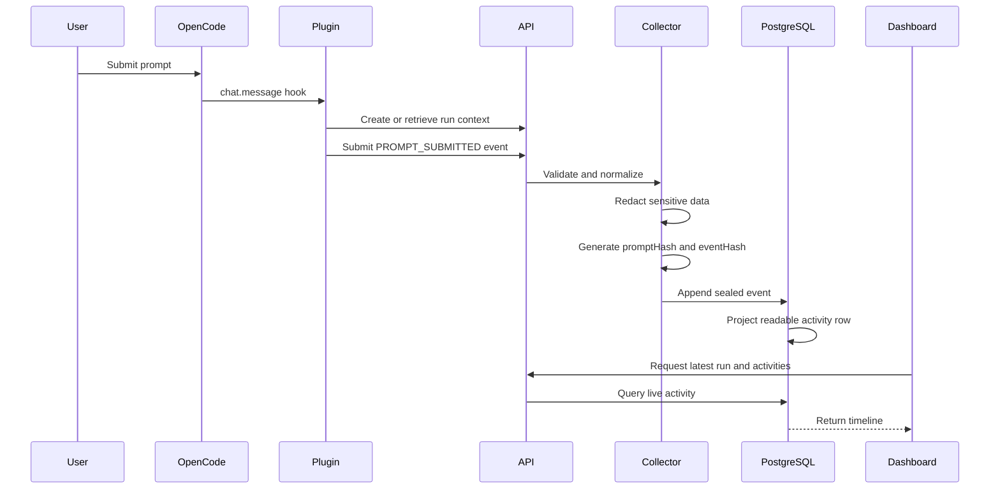
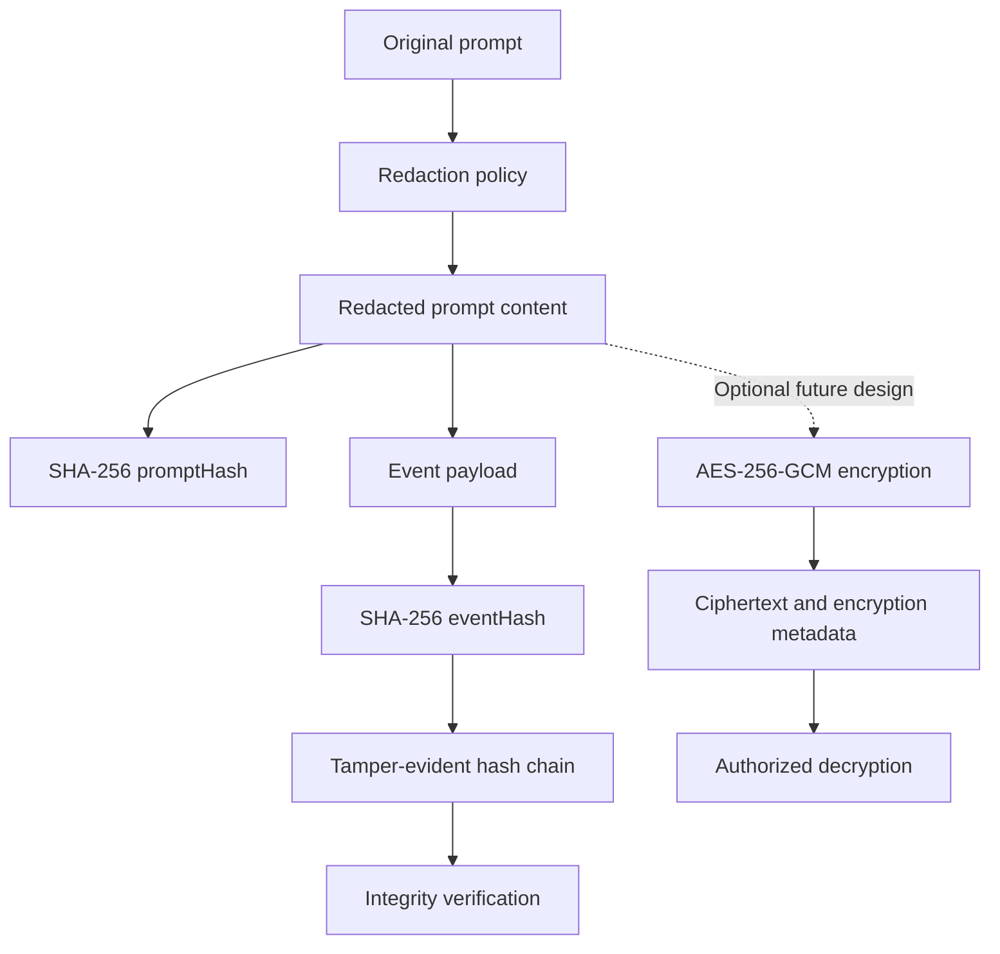
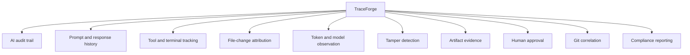
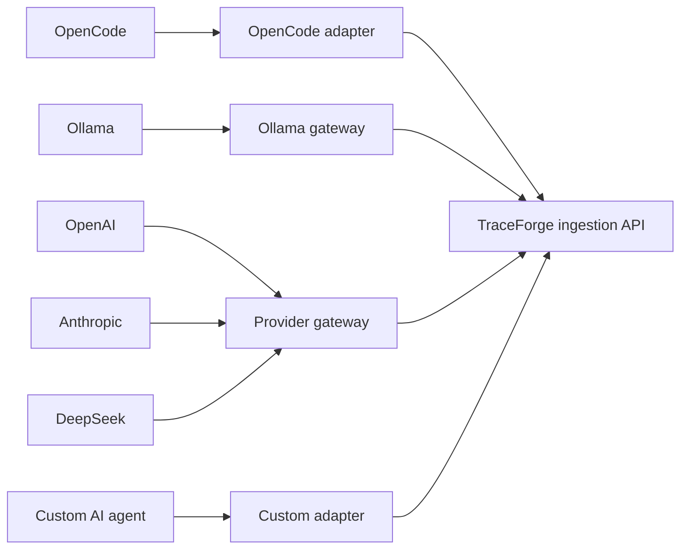

# TraceForge Workflow and Integration Guide

## 1. Purpose

TraceForge captures observable AI coding activity and converts it into a redacted, ordered, tamper-evident audit trail. It records prompts, model requests and responses, tools, terminal commands, file operations, resources, token usage, errors, artifacts, approvals, and Git associations when the connected adapter can observe them.

TraceForge never claims access to hidden model chain-of-thought. Only provider-exposed or user-visible information is recorded.

## 2. End-to-End Workflow



The normal event sequence for an OpenCode prompt is:

```text
SESSION_STARTED
PROMPT_SUBMITTED
AGENT_STARTED
MODEL_REQUEST
MODEL_RESPONSE
TOOL_STARTED / TOOL_COMPLETED (when used)
FILE_* / TERMINAL_COMMAND_* (when observed)
AGENT_COMPLETED or ERROR
```

## 3. OpenCode Capture Sequence



## 4. Inputs and Outputs by Stage

| Stage | Input | Output |
|---|---|---|
| OpenCode hook | User prompt or OpenCode activity | Session, message, agent, model, tool, or file metadata |
| OpenCode adapter | OpenCode hook payload | Normalized TraceForge event |
| Ingestion API | Authenticated event DTO | Accepted or duplicate result |
| Redaction | Raw event payload | Sanitized payload with secrets removed |
| Prompt hashing | Redacted prompt content | 64-character SHA-256 `promptHash` |
| Event sealing | Complete normalized event | `eventHash` and `previousEventHash` |
| Durable buffer | Sealed ingress record | Recoverable temporary disk record |
| PostgreSQL repository | Sealed event | Append-only provenance event |
| Activity projection | OpenCode provenance event | Readable `opencode_activities` row |
| Dashboard API | Latest run request | Run, events, activities, artifacts, and verification |
| Dashboard UI | Dashboard API response | Auto-refreshing activity timeline |

## 5. PostgreSQL Storage

The primary append-only event table is:

```text
traceforge_live.provenance_events
```

The pgAdmin-friendly OpenCode activity table is:

```text
public.opencode_activities
```

Important activity columns:

| Column | Purpose |
|---|---|
| `activity_id` | Unique activity identifier |
| `event_id` | Original provenance event identifier |
| `task_id` | TraceForge task identifier |
| `session_id` | TraceForge/OpenCode session association |
| `run_id` | Complete agent run identifier |
| `sequence` | Ordered position within the run |
| `activity_type` | Prompt, model, tool, file, terminal, or other event type |
| `actor_name` | Human, agent, model, tool, or system actor |
| `provider` | OpenAI, Ollama, Anthropic, DeepSeek, or another provider |
| `model` | Observed model identifier |
| `summary` | Short readable activity summary |
| `payload_redacted` | Detailed sanitized JSON payload |
| `occurred_at` | Time the source activity occurred |
| `recorded_at` | Time TraceForge recorded the activity |

Example query:

```sql
SELECT
    activity_type,
    summary,
    provider,
    model,
    occurred_at
FROM public.opencode_activities
ORDER BY recorded_at DESC;
```

## 6. Prompt Storage, Hashing, and Encryption



### Current behavior

- The OpenCode prompt is captured through the `chat.message` hook.
- Sensitive values are redacted before persistence.
- SHA-256 is calculated from the redacted prompt content.
- The sanitized content and `promptHash` are stored in the event payload.
- A separate `eventHash` protects the complete normalized event.
- `previousEventHash` links each event to the previous event in its run.
- The durable file buffer is temporary and is removed after successful database persistence.
- Prompt-specific encryption and recovery are not currently implemented.
- AES-256-GCM envelope encryption currently protects artifact content.

### Hashes cannot be decrypted

SHA-256 is a one-way integrity function, not encryption:

```text
prompt -> SHA-256 -> hash
hash -/-> original prompt
```

The stored hash can verify a supplied prompt:

```text
sha256(suppliedPrompt) == storedPromptHash
```

Recoverable protected prompts would require separate ciphertext, an IV, an authentication tag, and protected key metadata. The hash would still be retained for integrity verification.

## 7. Repository Structure and File Purposes

Generated content such as `node_modules`, `dist`, build caches, and coverage output is not included below.

### Root files

| File | Purpose |
|---|---|
| `package.json` | Workspace commands for build, test, migrations, and demo execution |
| `package-lock.json` | Reproducible dependency versions |
| `tsconfig.json` | TypeScript project references |
| `tsconfig.base.json` | Shared TypeScript compiler settings |
| `vitest.config.ts` | Repository-wide test configuration |
| `.env` | Local PostgreSQL 5432 connection settings |
| `.env.example` | Non-secret environment variable example |
| `.gitignore` | Excludes secrets, runtime state, dependencies, and build output |
| `README.md` | Primary setup and usage overview |

### OpenCode adapter: `packages/adapter-opencode`

| File | Purpose |
|---|---|
| `src/operational-plugin.ts` | Production OpenCode plugin entry point; loads secure settings and calls the TraceForge API |
| `src/plugin.ts` | Registers official OpenCode hooks and delegates them to the adapter |
| `src/opencode-adapter.ts` | Converts OpenCode messages, tools, sessions, diffs, and files into normalized events |
| `src/opencode-types.ts` | Local TypeScript representation of observable OpenCode payloads |
| `src/capabilities.ts` | Declares full, partial, and unavailable capture capabilities |
| `src/index.ts` | Public package exports |
| `test/opencode-adapter.test.ts` | Verifies prompt, model, tool, file, and session normalization |
| `package.json` | Adapter dependencies and package metadata |
| `tsconfig.json` | Adapter build configuration |

`operational-plugin.ts` performs four main operations:

1. Loads `TRACEFORGE_API_URL` and `TRACEFORGE_API_TOKEN`.
2. Maps each external OpenCode session to a TraceForge task, session, and run.
3. Sends normalized events to the authenticated ingestion API.
4. Replaces an oversized payload with its size and SHA-256 digest when it exceeds the capture limit.

### Adapter contracts: `packages/adapter-contracts`

| File or area | Purpose |
|---|---|
| Adapter interfaces | Standard lifecycle for OpenCode, Ollama, and custom adapters |
| `AdapterRunContext` | Carries `taskId`, `sessionId`, and `runId` |
| `NormalizedAgentEvent` | Common event format shared by all adapters |
| Capability declarations | Documents what an adapter can reliably observe |

### Collector: `packages/collector`

| File | Purpose |
|---|---|
| `src/collector/provenance-collector.ts` | Main validation, redaction, hashing, buffering, ordering, and persistence workflow |
| `src/collector/agent-adapter-bridge.ts` | Converts normalized adapter events into collector events |
| `src/contracts/raw-event.ts` | Raw and buffered event contracts |
| `src/redaction/redact-json.ts` | Removes secrets such as passwords, tokens, cookies, API keys, and database URLs |
| `src/validation/validate-raw-event.ts` | Rejects malformed events |
| `src/queue/run-serial-queue.ts` | Preserves event order within each run |
| `src/adapters/file-durable-buffer.ts` | Stores uncommitted events temporarily on disk |
| `src/adapters/in-memory-durable-buffer.ts` | Test and demo buffer |
| `src/adapters/encrypted-artifact-store.ts` | Encrypts and decrypts artifact content |
| `src/adapters/file-artifact-store.ts` | Stores encrypted artifact bytes on disk |
| `src/adapters/system-adapters.ts` | System clock and UUID implementations |
| `src/errors/collector-error.ts` | Collector-specific error codes |
| `test/*` | Collector ordering, idempotency, redaction, buffer, and artifact tests |

### Cryptography: `packages/crypto`

| File or area | Purpose |
|---|---|
| `hashing/sha256.ts` | Produces SHA-256 hashes |
| Canonical JSON utilities | Produce stable input for deterministic hashes |
| `encryption/envelope-encryption.ts` | AES-256-GCM encryption and decryption |
| `encryption/local-key-provider.ts` | Local development key wrapping |
| `encryption/aws-kms-key-provider.ts` | AWS KMS production key management |
| `test/*` | Encryption, authentication-tag, KMS, and hash tests |

### Provenance: `packages/provenance`

| File or area | Purpose |
|---|---|
| Event integrity | Calculates and verifies the event hash chain |
| Artifact integrity | Hashes and verifies artifact bytes and manifests |
| Redaction policy | Sanitizes sensitive strings before persistence |
| Tests | Detect tampering and verify redaction behavior |

The event chain works as follows:

```text
Event 1: previousEventHash = null, eventHash = AAA
Event 2: previousEventHash = AAA,  eventHash = BBB
Event 3: previousEventHash = BBB,  eventHash = CCC
```

Changing an earlier event causes chain verification to fail.

### Database: `packages/database`

| File | Purpose |
|---|---|
| `src/migrations/migration-runner.ts` | Runs ordered, checksum-protected SQL migrations |
| `src/migrate-cli.ts` | Implements `npm run db:migrate` |
| `src/postgres/postgres-event-repository.ts` | Atomically appends events and outbox messages |
| `src/postgres/postgres-api-store.ts` | Supplies dashboard/API read operations |
| `src/postgres/postgres-integration-context-registry.ts` | Maps external AI sessions to TraceForge contexts |
| `src/postgres/postgres-encrypted-artifact-metadata.ts` | Stores protected artifact encryption metadata |
| `src/postgres/postgres-approval-repository.ts` | Stores and reads human approvals |
| `src/postgres/postgres-git-provenance-repository.ts` | Stores Git correlation evidence |
| `src/postgres/postgres-outbox.ts` | Supports reliable downstream event delivery |
| `test/*` | Migration, repository, idempotency, and PostgreSQL integration tests |

### API: `packages/api` and `apps/api`

| File | Purpose |
|---|---|
| `packages/api/src/contracts.ts` | API DTOs, authentication scopes, and storage interfaces |
| `packages/api/src/handler.ts` | Routes, input validation, access control, and responses |
| API authentication files | Bearer-token authentication |
| `apps/api/src/main.ts` | Minimal process entry point and graceful shutdown wiring |
| `apps/api/src/composition-root.ts` | Selects concrete PostgreSQL, collector, encryption, archive, and API adapters |
| `apps/api/src/http-server.ts` | Node HTTP adapter, health endpoint, and Fetch API conversion |
| `apps/api/src/config.ts` | Validates runtime environment configuration |
| `apps/api/src/structured-log.ts` | JSON audit and error logging |

Important endpoints:

```text
POST /api/v1/integrations/context
POST /api/v1/integrations/events
GET  /api/v1/runs/latest
GET  /api/v1/runs/:runId
GET  /api/v1/runs/:runId/events
GET  /api/v1/activities/latest
POST /api/v1/runs/:runId/verify
```

### Dashboard: `apps/dashboard`

| File | Purpose |
|---|---|
| `app/page.tsx` | Live run, metrics, timeline, artifacts, and provenance UI |
| `app/globals.css` | Responsive dashboard styling |
| `app/layout.tsx` | Root layout and metadata |
| `app/api/dashboard/run/route.ts` | Secure server-side proxy to the TraceForge API |
| `worker/index.ts` | Cloudflare/Sites worker entry point |
| `vite.config.ts` | vinext, Vite, and Sites build configuration |
| `tests/local-server.mjs` | Local production-style dashboard server |
| `tests/cloudflare-loader.mjs` | Local Cloudflare runtime shim |
| `tests/rendered-html.test.mjs` | Server-rendered dashboard test |
| `.openai/hosting.json` | Sites project configuration |

The dashboard automatically requests the latest run when no `runId` is supplied and refreshes the activity feed every three seconds.

### Other adapters

| Package | Purpose |
|---|---|
| `packages/adapter-ollama` | Captures Ollama chat/generate prompts, responses, tokens, tools, and errors |
| `packages/adapter-model-gateways` | Captures hosted provider requests and responses, including OpenAI-compatible providers |
| `packages/sdk` | Application-facing TraceForge event API and transports |
| `packages/git` | Git metadata and byte-level artifact correlation |
| `packages/anchor` | External/local integrity anchoring |
| `packages/evaluation` | Measures observable provenance completeness without inventing evidence |
| `packages/domain` | Core entities, event types, and domain rules |
| `packages/application` | Ports and application-layer contracts |

### Infrastructure and scripts

| File | Purpose |
|---|---|
| `infrastructure/docker/compose.yml` | Optional PostgreSQL development container |
| `infrastructure/database/runtime-permissions.sql` | Restricts runtime database privileges |
| `scripts/start-local-operational.ps1` | Starts the local PostgreSQL/API operational stack |
| `scripts/use-postgres-5432.ps1` | Configures and migrates the system PostgreSQL instance |
| `scripts/smoke-opencode-capture.mjs` | Tests the complete capture pipeline without a paid model call |

## 8. Database Migrations

| Migration | Purpose |
|---|---|
| `001_initial_schema.sql` | Core tasks, sessions, runs, events, artifacts, approvals, Git, integrity, and outbox tables |
| `002_master_prompt_completeness.sql` | Projects, agents, test executions, and expanded event taxonomy |
| `003_integration_ingestion.sql` | External integration session mapping |
| `004_opencode_activity_feed.sql` | Internal OpenCode activity projection |
| `005_traceforge_activity_table.sql` | Historical `_traceforge` activity table migration |
| `006_public_traceforge_activity.sql` | Historical public `_traceforge` mirror |
| `007_public_opencode_activities.sql` | Final pgAdmin-visible `public.opencode_activities` table |
| `008_remove_legacy_traceforge_tables.sql` | Removes obsolete `_traceforge` tables and triggers |

The final user-facing activity table is `public.opencode_activities`.

## 9. Main Use Cases



TraceForge can answer questions such as:

- What prompt did the developer submit?
- Which provider and model were used?
- Which tools and terminal commands were executed?
- Which files were read, created, modified, or deleted?
- How many tokens were reported by the provider?
- Has the event history been modified?
- Which run is associated with a Git commit?
- Which artifacts received human approval?

## 10. Using TraceForge with Other AI Systems

The OpenCode plugin is specific to OpenCode hooks. Other systems should use an existing gateway or implement the common adapter contract.



### OpenCode

Register the built plugin in the global OpenCode configuration:

```json
{
  "plugin": [
    "file:///H:/aqibDev/opencode-works/packages/adapter-opencode/dist/operational-plugin.js"
  ]
}
```

Start the API and use OpenCode normally:

```powershell
.\scripts\start-local-operational.ps1
opencode
```

### Ollama

Use `packages/adapter-ollama` and connect its events to the TraceForge collector or ingestion API:

```ts
const gateway = new OllamaGateway();

await gateway.initialize({
  baseUrl: "http://127.0.0.1:11434",
  clock,
  ids
});

gateway.onEvent(traceForgeHandler);
await gateway.start();
```

Typical output:

```text
PROMPT_SUBMITTED
MODEL_REQUEST
MODEL_RESPONSE
ERROR
```

### OpenAI, Anthropic, and DeepSeek

Route provider requests through `packages/adapter-model-gateways`:

```text
Application
  -> TraceForge provider gateway
  -> AI provider
  -> Provider response
  -> TraceForge capture
  -> Application response
```

The gateway needs:

- Provider base URL
- Authentication headers
- Provider request/response profile
- TraceForge run context
- TraceForge event handler

### Custom AI Agent

A custom integration should produce normalized events containing:

```ts
{
  taskId,
  sessionId,
  runId,
  eventType,
  actor,
  payload,
  providerEventId,
  evidence
}
```

Submit events to:

```text
POST /api/v1/integrations/events
```

Recommended minimum event set:

```text
PROMPT_SUBMITTED
MODEL_REQUEST
MODEL_RESPONSE
AGENT_COMPLETED
ERROR
```

Every integration must use stable provider event IDs for idempotency and must distinguish observed, declared, inferred, unavailable, and not-observed evidence.

## 11. Running and Verifying

Configure PostgreSQL 5432 and apply migrations:

```powershell
.\scripts\use-postgres-5432.ps1
```

Start or restart the API, then run OpenCode:

```powershell
opencode
```

Run the capture smoke test:

```powershell
node scripts/smoke-opencode-capture.mjs
```

Start the dashboard:

```powershell
cd apps\dashboard
$env:PORT=3002
npm run dev
```

Open:

```text
http://localhost:3002
```

Verify database activity:

```sql
SELECT *
FROM public.opencode_activities
ORDER BY recorded_at DESC;
```

Verify an event chain through the API:

```text
POST /api/v1/runs/:runId/verify
```

## 12. Known Limitations

- Hidden model chain-of-thought is not observable.
- SHA-256 hashes cannot be decrypted.
- Prompt-specific encrypted recovery is not implemented.
- File-operation detail depends on information exposed by the source adapter.
- Resource attribution is partial when a tool does not expose resource identity.
- Provider token and cost values are only recorded when exposed by the provider.
- The hosted dashboard requires a private binding to the TraceForge API.
- The local key provider is for development; managed KMS should be used in production.

## 13. Summary

```text
OpenCode or AI provider
  -> TraceForge adapter
  -> authenticated API
  -> validation and redaction
  -> SHA-256 prompt/event hashing
  -> durable buffering
  -> PostgreSQL provenance chain
  -> public.opencode_activities
  -> live dashboard
```

TraceForge provides observable evidence of AI-assisted engineering activity without claiming access to hidden reasoning.
